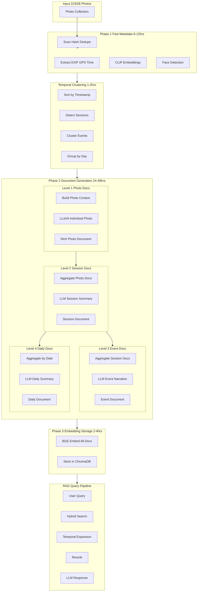
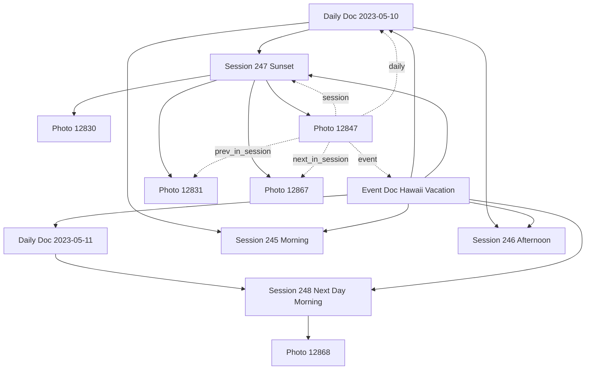
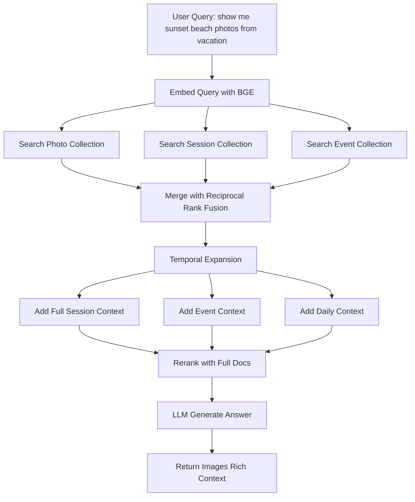

# Photo Processing & RAG Pipeline with Multi-Level Temporal Documentation

## Core Focus

**Photos Only** (videos later), **No Go services** (future work)**Main Innovation**: Generate rich, interconnected documents at 4 levels using Vision LLM with temporal consistency, creating a hierarchical knowledge base for advanced RAG queries.

## Tech Stack

### Core Processing

- **Python 3.11+**
- **OpenCV + Pillow**: Image processing
- **face_recognition**: Face detection/encoding
- **exifread**: EXIF/GPS extraction
- **scikit-learn**: Temporal clustering (DBSCAN)

### Vision & Embeddings

- **CLIP ViT-B/32**: Fast semantic embeddings (512-dim)
- **LLaVA 1.6 (13B/34B)**: Vision LLM for rich descriptions
- **BGE-large-en-v1.5**: High-quality text embeddings (1024-dim)

### Storage

- **ChromaDB**: Vector storage (3 collections)
- **SQLite**: Metadata + temporal relationships

### LLM

- **LLaVA 1.6**: Local vision descriptions
- **Claude/GPT-4**: Aggregation & summarization (API)

## Architecture Overview




## Multi-Level Temporal Clustering

### Level 1: Photo Sessions (Time Gaps)

**Algorithm**: Group photos by time continuity

```python
def detect_sessions(photos_sorted_by_time):
    """
    Create sessions when gap > 30 minutes.
    Each session = continuous shooting period.
    """
    sessions = []
    current = [photos[0]]
    
    for i in range(1, len(photos)):
        gap = photos[i].timestamp - photos[i-1].timestamp
        
        if gap > timedelta(minutes=30):
            # New session
            sessions.append({
                'photos': current,
                'start': current[0].timestamp,
                'end': current[-1].timestamp,
                'duration': current[-1].timestamp - current[0].timestamp,
                'location': get_avg_location(current),
                'count': len(current)
            })
            current = [photos[i]]
        else:
            current.append(photos[i])
    
    return sessions

# Example output:
# Session 1: 2023-05-10 14:23 - 14:45 (22 min, 15 photos) at Waikiki Beach
# Session 2: 2023-05-10 17:30 - 18:15 (45 min, 38 photos) at Hotel Pool
# Session 3: 2023-05-10 19:45 - 20:30 (45 min, 27 photos) at Restaurant
```


### Level 2: Events (Location + Time Clusters)

**Algorithm**: DBSCAN clustering on (lat, lon, date)

```python
def detect_events(sessions):
    """
    Cluster sessions by location and temporal proximity.
    Event = multiple sessions at same place/time.
    """
    # Feature vector: (lat, lon, day_number, hour_of_day)
    features = []
    for s in sessions:
        if s.location:
            features.append([
                s.location.lat,
                s.location.lon,
                s.start.toordinal(),  # day number
                s.start.hour / 24.0   # normalized hour
            ])
    
    # Cluster with DBSCAN
    # eps = 0.5km spatial + 12 hours temporal
    clustering = DBSCAN(
        eps=0.01,  # ~1km at equator
        min_samples=2,
        metric='euclidean'
    ).fit(features)
    
    # Group sessions by cluster
    events = {}
    for session, label in zip(sessions, clustering.labels_):
        if label not in events:
            events[label] = []
        events[label].append(session)
    
    return events

# Example output:
# Event 1: Hawaii Vacation (May 10-15, 2023)
#   - 12 sessions, 387 photos
#   - Locations: Waikiki, North Shore, Diamond Head
# Event 2: Sarah's Wedding (June 3, 2023)
#   - 4 sessions, 156 photos
#   - Locations: Church, Reception Hall
```


### Level 3: Daily Groupings

**Simple**: All photos taken on same date

```python
def group_by_day(photos):
    """Group all photos by calendar date."""
    days = {}
    for photo in photos:
        date = photo.timestamp.date()
        if date not in days:
            days[date] = []
        days[date].append(photo)
    return days
```


## Multi-Level Document Generation Pipeline

### Level 1: Individual Photo Documents (LLaVA)

**Goal**: Rich, detailed description of each photo with temporal context

#### Context Building

```python
def build_photo_context(photo, session, event):
    """
    Build contextual information for LLaVA prompt.
    """
    context = {
        'timestamp': photo.timestamp,
        'location': reverse_geocode(photo.lat, photo.lon) if photo.gps else None,
        'camera': f"{photo.camera_make} {photo.camera_model}",
        'settings': f"ISO {photo.iso}, f/{photo.aperture}, {photo.shutter_speed}",
        
        # Session context
        'session_info': {
            'number': photo.sequence_in_session,
            'total': session.photo_count,
            'duration': session.duration,
            'location': session.location_name
        },
        
        # Previous photos (temporal context)
        'previous_photos': [
            get_mini_description(p) 
            for p in session.photos[max(0, photo.index-3):photo.index]
        ],
        
        # Next photos (look ahead)
        'next_photos': [
            get_mini_description(p)
            for p in session.photos[photo.index+1:photo.index+4]
        ],
        
        # Event context
        'event_context': {
            'name': event.name if event else None,
            'type': event.event_type if event else None,
            'day_of_event': get_day_number(photo, event) if event else None
        },
        
        # Face context
        'faces_detected': photo.face_count,
        'face_positions': [f.bbox for f in photo.faces]
    }
    
    return context
```


#### LLaVA Prompting Strategy

```python
def generate_photo_description(image, context):
    """
    Generate rich description using LLaVA with temporal context.
    """
    
    # Build context summary
    prev_context = ""
    if context['previous_photos']:
        prev_context = "Previous photos in this session showed: " + \
                      ", ".join(context['previous_photos'])
    
    session_info = f"""
This is photo {context['session_info']['number']} of {context['session_info']['total']} 
from a {context['session_info']['duration']} minute session at {context['session_info']['location']}.
"""
    
    event_info = ""
    if context['event_context']['name']:
        event_info = f"""
This photo is part of: {context['event_context']['name']} 
({context['event_context']['type']}, day {context['event_context']['day_of_event']}).
"""
    
    # Comprehensive prompt
    prompt = f"""You are analyzing a photograph for a searchable personal photo archive. 
Provide a detailed, factual description that will help find this photo later.

CONTEXT:
- Date/Time: {context['timestamp']}
- Location: {context['location'] or 'Unknown'}
- Camera: {context['camera']} ({context['settings']})
{session_info}
{event_info}
{prev_context}

DESCRIBE IN DETAIL:

1. SUBJECTS: Who or what is the main focus? Describe people, their appearance, 
   expressions, poses, activities. If faces detected ({context['faces_detected']}), 
   describe each person.

2. SETTING: Indoor or outdoor? Specific location details? Time of day? 
   Weather? Architecture? Natural features?

3. COMPOSITION: What's in foreground, middle, background? Camera angle? 
   Perspective? Framing?

4. VISUAL ELEMENTS:
    - Lighting: Natural/artificial? Quality? Direction? Mood?
    - Colors: Dominant colors, color harmony, saturation
    - Objects: Notable items, props, decorations
    - Text: Any visible text, signs, labels (transcribe them)

5. ACTIVITY & STORY: What's happening? What action or moment is captured? 
   How does this relate to previous photos in the session?

6. MOOD & ATMOSPHERE: Emotional tone? Formal/casual? Energetic/calm?

7. TECHNICAL: Notable depth of field, motion blur, exposure quality?

Be specific and descriptive. Write 200-300 words. Use clear, searchable language.
Avoid generic phrases. Focus on distinctive, memorable details."""

    # Generate with LLaVA
    description = llava_model.generate(
        image=image,
        prompt=prompt,
        max_tokens=400,
        temperature=0.3  # Lower temp for factual consistency
    )
    
    return description
```


#### Photo Document Structure

```python
# Example generated photo document
photo_doc = {
    'media_id': 12847,
    'file_path': '/photos/2023/05/IMG_5847.jpg',
    'timestamp': '2023-05-10 17:45:23',
    'location': 'Waikiki Beach, Honolulu, Hawaii',
    
    # Full LLaVA description
    'description': """
A vibrant sunset photograph at Waikiki Beach featuring two people 
silhouetted against a dramatic orange and pink sky. The main subjects 
are standing at the water's edge, one person on the left with arms raised 
in a celebratory pose, the other on the right in a relaxed stance. 

The setting is clearly a tropical beach at golden hour, with gentle waves 
lapping at the shore and Diamond Head crater visible in the distant right 
background. The wet sand in the foreground reflects the colorful sky, 
creating a mirror effect. Several palm trees frame the left side of the 
composition.

The lighting is spectacular with the sun just above the horizon, creating 
a warm orange glow that transitions to pink and purple in the upper sky. 
Long shadows stretch across the sand. The composition follows rule of 
thirds with subjects positioned off-center.

This is the 8th photo in a 15-photo session capturing the sunset. Previous 
photos showed the same subjects approaching the water and taking various 
poses. The mood is joyful and triumphant, capturing a memorable vacation 
moment. Shot with Canon EOS R5, ISO 100, f/8, creating sharp silhouettes 
with excellent dynamic range in the sky.

Part of Hawaii Vacation day 3, consistent with other beach sunset sessions 
from this trip.
""",
    
    # Extracted structured data
    'structured': {
        'subjects': ['person 1 celebrating', 'person 2 standing'],
        'subject_count': 2,
        'scene_type': 'outdoor',
        'location_type': 'beach',
        'time_of_day': 'sunset/golden hour',
        'weather': 'clear',
        'mood': ['joyful', 'celebratory', 'peaceful'],
        'colors': ['orange', 'pink', 'purple', 'silhouette'],
        'landmarks': ['Diamond Head', 'palm trees'],
        'activities': ['posing', 'celebrating'],
        'composition_notes': 'rule of thirds, silhouette',
        'visible_text': None
    },
    
    # Temporal context
    'session_id': 247,
    'event_id': 15,
    'sequence_in_session': 8,
    'sequence_in_event': 127,
    
    # Technical metadata
    'exif': {
        'camera': 'Canon EOS R5',
        'iso': 100,
        'aperture': 8.0,
        'shutter_speed': '1/250',
        'focal_length': 35
    },
    
    # Links to other documents
    'related_session_doc_id': 247,
    'related_event_doc_id': 15,
    'related_daily_doc_id': '2023-05-10'
}
```


### Level 2: Session Documents (LLM Aggregation)

**Goal**: Coherent narrative of each photo session

#### Session Document Generation

```python
def generate_session_document(session, photo_docs):
    """
    Aggregate photo descriptions into session narrative.
    """
    
    # Prepare context
    photo_summaries = [
        f"Photo {i+1}: {doc['structured']['subjects']}, "
        f"{doc['structured']['activities']}, "
        f"{doc['structured']['mood']}"
        for i, doc in enumerate(photo_docs)
    ]
    
    # Sample 5-10 representative full descriptions
    key_photos = select_representative_photos(photo_docs, n=7)
    full_descriptions = [doc['description'] for doc in key_photos]
    
    prompt = f"""Analyze this photo session and create a comprehensive summary.

SESSION METADATA:
- Date/Time: {session.start} to {session.end} ({session.duration} minutes)
- Location: {session.location_name}
- Photo count: {session.photo_count}
- GPS: {session.avg_lat}, {session.avg_lon}

PHOTO PROGRESSION:
{chr(10).join(f"{i+1}. {s}" for i, s in enumerate(photo_summaries))}

DETAILED DESCRIPTIONS OF KEY PHOTOS:
{chr(10).join(f"--- Photo {idx} ---{chr(10)}{desc}{chr(10)}" for idx, desc in full_descriptions)}

Create a 300-400 word narrative summary that:

1. OVERVIEW: What is this session about? What's the main activity/event?

2. PROGRESSION: How does the session evolve? Beginning, middle, end?
   What story do these photos tell together?

3. SUBJECTS: Who appears? What are they doing? Any changes in their activities?

4. SETTING: Detailed description of the location and environment.

5. NOTABLE MOMENTS: Highlight 3-5 key photos and what makes them special.

6. ATMOSPHERE: Overall mood, lighting conditions, time of day progression.

7. TECHNICAL: Common shooting style, camera work, any notable techniques.

Write in a flowing narrative style, as if describing the session to someone 
who wasn't there. Be specific and vivid."""

    session_narrative = claude_api.generate(
        prompt=prompt,
        max_tokens=600,
        temperature=0.4
    )
    
    return session_narrative
```


#### Session Document Structure

```python
# Example session document
session_doc = {
    'session_id': 247,
    'start_time': '2023-05-10 17:30:00',
    'end_time': '2023-05-10 18:15:00',
    'duration_minutes': 45,
    'photo_count': 38,
    'location': 'Waikiki Beach, Honolulu, Hawaii',
    'event_id': 15,
    
    # Generated narrative
    'narrative': """
This 45-minute golden hour photo session at Waikiki Beach captures a 
magical sunset experience that progresses from beach arrival to stunning 
silhouette photography.

The session begins with two people arriving at the beach around 5:30 PM, 
carrying towels and cameras. Initial photos show them exploring the beach, 
wading into the shallow water, and testing different angles. The lighting 
is still bright, with the sun about 20 degrees above the horizon, creating 
warm but not dramatic illumination.

As the session progresses (photos 8-20), the subjects become more 
experimental with poses. They move closer to the water's edge, creating 
reflection opportunities. The photographer clearly shifts focus to capture 
the rapidly changing sky colors, transitioning from blue to gold to orange. 
Multiple attempts at jumping shots and celebratory poses show the playful, 
vacation mood.

The climax comes in photos 25-32, when the sun touches the horizon. Here, 
the photographer switches to silhouette mode, exposing for the vibrant sky 
and letting the subjects become dark figures. These images are the strongest 
of the set, with dramatic orange and pink skies, perfect reflections in the 
wet sand, and well-composed silhouettes. Diamond Head crater provides a 
recognizable landmark in several frames.

The session concludes with wider landscape shots as the sun dips below the 
horizon, capturing the afterglow and the beach's transformation into twilight. 
The final photos show other beachgoers and the general scene, providing 
context for the location and atmosphere.

Shot entirely with a Canon EOS R5 at ISO 100-400, the photographer 
demonstrates good technical control, particularly in managing the extreme 
dynamic range during sunset. The composition consistently follows rule of 
thirds, and the progression shows clear intent and experimentation.

Overall, this session perfectly captures a quintessential Hawaii vacation 
moment: sunset at Waikiki, combining technical photography skill with 
genuine joy and celebration.
""",
    
    # Extracted session metadata
    'session_type': 'beach sunset photography',
    'primary_activity': 'sunset photography',
    'subjects': ['2 people'],
    'mood': ['playful', 'celebratory', 'artistic'],
    'location_type': 'beach',
    'time_of_day': 'golden hour to twilight',
    'weather': 'clear',
    'photography_style': 'landscape and silhouette',
    
    # Key moments
    'highlights': [
        {'photo_id': 12847, 'reason': 'Best silhouette shot'},
        {'photo_id': 12851, 'reason': 'Perfect sunset colors'},
        {'photo_id': 12839, 'reason': 'Joyful jumping pose'}
    ],
    
    # Links
    'photo_ids': [12830, 12831, ..., 12867],
    'event_doc_id': 15,
    'daily_doc_id': '2023-05-10'
}
```


### Level 3: Event Documents (Multi-Session Narrative)

**Goal**: Comprehensive story spanning multiple sessions

#### Event Document Generation

```python
def generate_event_document(event, session_docs, photo_docs):
    """
    Create event-level narrative from multiple sessions.
    """
    
    # Prepare session summaries
    session_summaries = []
    for sess_doc in session_docs:
        summary = f"""
Session {sess_doc['session_id']} ({sess_doc['start_time'].strftime('%b %d, %H:%M')}):
Location: {sess_doc['location']}
Duration: {sess_doc['duration_minutes']} min, {sess_doc['photo_count']} photos
Summary: {sess_doc['narrative'][:200]}...
Key highlights: {', '.join([h['reason'] for h in sess_doc['highlights']])}
"""
        session_summaries.append(summary)
    
    # Sample photos across entire event
    representative_photos = select_representative_across_sessions(
        photo_docs, 
        sessions=len(session_docs),
        samples_per_session=3
    )
    
    prompt = f"""Analyze this multi-session event and create a comprehensive narrative.

EVENT METADATA:
- Name: {event.name}
- Date Range: {event.start_date} to {event.end_date} ({event.duration_days} days)
- Location(s): {', '.join(event.locations)}
- Total Sessions: {len(session_docs)}
- Total Photos: {event.photo_count}

SESSION BREAKDOWN:
{chr(10).join(session_summaries)}

REPRESENTATIVE PHOTOS FROM ACROSS THE EVENT:
{chr(10).join([doc['description'] for doc in representative_photos])}

Create a 500-600 word event narrative that:

1. OVERVIEW: What is this event? Why are these photos being taken?
   What's the occasion or purpose?

2. TIMELINE: Chronicle the event chronologically. What happens when?
   How do activities flow across sessions and days?

3. LOCATIONS: Describe the different locations visited. How do they connect?

4. PARTICIPANTS: Who is present? Any notable interactions or relationships?

5. STORY ARC: Beginning, development, climax, conclusion. Does the event
   have a narrative structure?

6. HIGHLIGHTS: Top 5-7 memorable moments across all sessions.

7. THEMES: What are the recurring themes, moods, or activities?

8. CONTEXT: Place this event in larger context (vacation, celebration,
   family gathering, etc.)

Write as a coherent story that someone could read to understand the entire 
event without seeing the photos."""

    event_narrative = claude_api.generate(
        prompt=prompt,
        max_tokens=800,
        temperature=0.5
    )
    
    # Extract event type using classification
    event_type = classify_event_type(event_narrative, session_docs)
    
    return event_narrative, event_type
```


#### Event Document Structure

```python
# Example event document
event_doc = {
    'event_id': 15,
    'name': 'Hawaii Vacation May 2023',
    'event_type': 'vacation',
    'start_date': '2023-05-10',
    'end_date': '2023-05-15',
    'duration_days': 6,
    'session_count': 12,
    'photo_count': 387,
    'locations': ['Waikiki Beach', 'North Shore', 'Diamond Head', 'Pearl Harbor'],
    
    # Full narrative
    'narrative': """
This six-day Hawaiian vacation in May 2023 captures a comprehensive tropical 
getaway, chronicling beach adventures, cultural exploration, and scenic 
photography across Oahu's most iconic locations.

The journey begins on May 10th with arrival shots at the hotel and immediate 
beach exploration at Waikiki. The first day's three photo sessions show the 
excitement of arrival: testing the water, walking along the famous beach, 
and culminating in that spectacular golden hour sunset session that produced 
some of the trip's most stunning silhouette photographs. The mood is clearly 
joyful and energetic, with two travelers eager to document their adventure.

Days 2 and 3 expand the geographical scope. Morning sessions capture breakfast 
spots and urban Honolulu, while midday adventures venture to Diamond Head for 
the challenging hike and panoramic crater views. The progression of photos up 
the trail shows increasing elevation and widening vistas. A snorkeling session 
at Hanauma Bay provides vibrant underwater photography attempts, though the 
image quality suggests the challenges of underwater shooting without 
specialized equipment.

The trip's midpoint features a cultural day at Pearl Harbor and the Polynesian 
Cultural Center. Photos shift from somber memorial photography to vibrant 
cultural performances and traditional demonstrations. This tonal shift is 
notable and well-captured, showing the travelers' respect for historical sites 
while embracing the celebratory aspects of Hawaiian culture.

Days 4 and 5 focus on the North Shore, with dramatic wave photography at 
Sunset Beach and Waimea Bay. The scale of the surf is evident in photos 
showing tiny surfers against massive swells. Sessions here are longer and 
more contemplative, with golden hour beach walks and attempts to capture the 
raw power of the ocean. Food photography also emerges, documenting the famous 
shrimp trucks and shave ice stops.

The final day brings a return to Waikiki for last beach moments, souvenir 
shopping in touristy areas, and farewell sunset photos that mirror the arrival 
day but with a more reflective, slightly melancholy mood. The photographers 
clearly know these are their final shots, taking time to recreate earlier 
compositions and capture comprehensive farewell images.

HIGHLIGHTS:
1. Waikiki sunset silhouettes (Day 1) - technical and emotional peak
2. Diamond Head summit panoramas (Day 2) - achievement and scale
3. Pearl Harbor memorial (Day 3) - historical gravitas
4. North Shore big wave photography (Day 4) - nature's power
5. Cultural performance at luau (Day 3) - vibrant action shots
6. Snorkeling attempts (Day 2) - adventurous spirit
7. Final farewell sunset (Day 6) - emotional conclusion

THEMES: The event consistently emphasizes natural beauty, adventure, cultural 
appreciation, and companionship. Photography style evolves from excited 
snapshots to more thoughtful composition as the trip progresses. Recurring 
elements include golden hour beach photography, food documentation, and 
couples posing at scenic overlooks.

This vacation showcases classic Hawaiian tourism while demonstrating genuine 
engagement with the location beyond superficial sightseeing. The photographic 
documentation is thorough, artistic, and emotionally resonant, creating a 
complete visual narrative of a memorable trip.
""",
    
    'themes': [
        'beach and ocean',
        'cultural exploration',
        'adventure and hiking',
        'sunset photography',
        'food and local cuisine',
        'couples vacation'
    ],
    
    'top_highlights': [
        {'photo_id': 12847, 'description': 'Iconic Waikiki sunset silhouette'},
        {'photo_id': 12903, 'description': 'Diamond Head summit panorama'},
        # ... more highlights
    ],
    
    'participant_summary': '2 people, couple, ages 25-35 (estimated)',
    'photography_quality': 'high - consistent technical skill, artistic intent',
    
    # Links
    'session_ids': [245, 246, 247, 248, ...],
    'daily_doc_ids': ['2023-05-10', '2023-05-11', ...]
}
```


### Level 4: Daily Summary Documents

**Goal**: What happened each day across all events

#### Daily Document Generation

```python
def generate_daily_document(date, sessions_that_day, events_that_day):
    """
    Generate daily summary across potentially multiple events.
    """
    
    # Aggregate all activity
    total_photos = sum(s.photo_count for s in sessions_that_day)
    all_locations = list(set(s.location_name for s in sessions_that_day))
    
    # Get session narratives
    session_texts = [
        f"{s.start_time.strftime('%H:%M')}: {s.narrative[:150]}..."
        for s in sessions_that_day
    ]
    
    prompt = f"""Summarize this day's photographic activity.

DATE: {date.strftime('%A, %B %d, %Y')}
TOTAL PHOTOS: {total_photos}
SESSIONS: {len(sessions_that_day)}
LOCATIONS: {', '.join(all_locations)}
EVENTS: {', '.join(e.name for e in events_that_day)}

CHRONOLOGICAL SESSION SUMMARIES:
{chr(10).join(session_texts)}

Create a 200-300 word daily summary that:

1. Overview of the day's activities in chronological order
2. Highlight 2-3 key moments or sessions
3. Note any transitions between locations or activities
4. Describe the overall character of the day
5. Connect to larger events if applicable

Write in past tense as a daily journal entry."""

    daily_summary = claude_api.generate(prompt=prompt, max_tokens=400)
    
    return daily_summary
```


#### Daily Document Structure

```python
# Example daily document
daily_doc = {
    'date': '2023-05-10',
    'day_of_week': 'Wednesday',
    'photo_count': 82,
    'session_count': 3,
    'locations': ['Waikiki Beach', 'Hotel', 'Beachfront Restaurant'],
    'events': [15],  # Hawaii Vacation
    
    'summary': """
Wednesday, May 10th marked the exciting first day of the Hawaii vacation, 
capturing the transition from arrival to full vacation mode. The day produced 
82 photos across three distinct sessions.

The morning began with arrival documentation at the hotel, including room 
photos and balcony ocean views. Energy was high with typical vacation arrival 
excitement. By early afternoon, a beach exploration session captured first 
impressions of Waikiki - the famous beach, testing the water temperature, and 
walking along the shore to get oriented.

The day's highlight came during the extended golden hour session from 5:30-6:15 PM. 
This 45-minute sunset photography session at the beach produced the day's best 
images, with stunning silhouette shots against dramatic orange skies. The 
progression from arrival to artistic sunset photography shows rapid adaptation 
to vacation mode.

The evening concluded with dinner at a beachfront restaurant, documented with 
food photography and nighttime beach views. Overall, the day transitions from 
travel fatigue to vacation excitement, ending on a high note with those 
spectacular sunset images. The photography style evolved from quick snapshots 
to more thoughtful composition as the day progressed.
""",
    
    'highlights': [
        {'session_id': 247, 'reason': 'Spectacular sunset photography'},
        {'photo_id': 12847, 'reason': 'Best photo of the day'}
    ],
    
    'mood': 'excited, joyful, artistic',
    'weather': 'sunny, clear',
    
    # Links
    'session_ids': [245, 246, 247],
    'event_ids': [15]
}
```


## Document Hierarchies & Temporal Links

### Relationship Graph




### Temporal Context Retrieval

```python
def get_temporal_context(photo_id):
    """
    Retrieve full temporal context for any photo.
    """
    return {
        # Photo level
        'photo_doc': get_photo_doc(photo_id),
        
        # Immediate neighbors
        'previous_photos': get_session_photos(photo_id, offset=-3, limit=3),
        'next_photos': get_session_photos(photo_id, offset=1, limit=3),
        
        # Session level
        'session_doc': get_session_doc(photo_id),
        'all_session_photos': get_all_session_photos(photo_id),
        
        # Event level
        'event_doc': get_event_doc(photo_id),
        'other_event_sessions': get_other_event_sessions(photo_id),
        
        # Daily level
        'daily_doc': get_daily_doc(photo_id),
        'other_daily_sessions': get_other_daily_sessions(photo_id)
    }
```


## Embedding Strategy

### Three ChromaDB Collections

#### Collection 1: Photo-Level (CLIP + Description)

```python
photo_collection = {
    'name': 'photo_docs',
    'embeddings': BGE-large embedding of full photo document,
    'metadata': {
        'media_id': int,
        'timestamp': str,
        'location': str,
        'session_id': int,
        'event_id': int,
        'scene_type': str,
        'has_faces': bool,
        'subjects_count': int
    },
    'documents': [
        # Full text: description + structured data + context
        """A vibrant sunset photograph at Waikiki Beach featuring two 
        people silhouetted against dramatic orange sky...
        [full LLaVA description]
        
        Session context: Photo 8 of 15 from golden hour beach session
        Event context: Hawaii Vacation day 3
        Subjects: 2 people celebrating
        Location: Waikiki Beach, Honolulu, Hawaii
        Mood: joyful, celebratory
        Technical: Canon EOS R5, ISO 100, f/8"""
    ]
}
```


#### Collection 2: Session-Level

```python
session_collection = {
    'name': 'session_docs',
    'embeddings': BGE-large embedding of session narrative,
    'metadata': {
        'session_id': int,
        'start_time': str,
        'duration_minutes': int,
        'photo_count': int,
        'location': str,
        'event_id': int,
        'session_type': str
    },
    'documents': [
        # Full session narrative
        """This 45-minute golden hour photo session at Waikiki Beach 
        captures a magical sunset experience...
        [full session narrative]
        
        Highlights: Best silhouette shot, Perfect sunset colors
        Progression: Arrival → Experimentation → Sunset climax → Afterglow
        Location: Waikiki Beach
        Event: Hawaii Vacation day 3"""
    ]
}
```


#### Collection 3: Event/Daily Level

```python
event_collection = {
    'name': 'event_and_daily_docs',
    'embeddings': BGE-large embedding of event/daily narratives,
    'metadata': {
        'doc_type': 'event' or 'daily',
        'doc_id': int or str,
        'start_date': str,
        'end_date': str,
        'photo_count': int,
        'session_count': int,
        'locations': list
    },
    'documents': [
        # Full event narrative or daily summary
        """This six-day Hawaiian vacation in May 2023 captures a 
        comprehensive tropical getaway...
        [full event narrative]
        
        Locations: Waikiki, North Shore, Diamond Head
        Duration: 6 days, 12 sessions, 387 photos
        Themes: beach, cultural exploration, adventure
        Highlights: Sunset silhouettes, Diamond Head hike, Pearl Harbor"""
    ]
}
```


## Advanced RAG Query Pipeline

### Multi-Level Search Strategy




### Implementation

```python
def advanced_rag_query(user_query, top_k=20):
    """
    Multi-level hierarchical search with temporal expansion.
    """
    
    # 1. Embed query
    query_embedding = bge_model.encode(user_query)
    
    # 2. Search all three collections in parallel
    photo_results = photo_collection.query(
        query_embeddings=[query_embedding],
        n_results=50
    )
    
    session_results = session_collection.query(
        query_embeddings=[query_embedding],
        n_results=20
    )
    
    event_results = event_collection.query(
        query_embeddings=[query_embedding],
        n_results=10,
        where={'doc_type': 'event'}  # or 'daily' for date queries
    )
    
    # 3. Reciprocal Rank Fusion
    merged = reciprocal_rank_fusion([
        photo_results,
        session_results,
        event_results
    ], weights=[0.5, 0.3, 0.2])
    
    # 4. Temporal expansion
    expanded = []
    for result in merged[:top_k]:
        if result.level == 'photo':
            # Add surrounding photos from session
            session_photos = get_session_neighbors(
                result.media_id,
                before=2,
                after=2
            )
            result.context_photos = session_photos
            result.session_doc = get_session_doc(result.session_id)
            result.event_doc = get_event_doc(result.event_id)
            
        elif result.level == 'session':
            # Add all session photos
            result.all_photos = get_all_session_photos(result.session_id)
            result.event_doc = get_event_doc(result.event_id)
            
        elif result.level == 'event':
            # Add representative photos from event
            result.highlight_photos = get_event_highlights(result.event_id)
            result.all_sessions = get_event_sessions(result.event_id)
        
        expanded.append(result)
    
    # 5. Rerank with full context
    reranked = rerank_with_llm(expanded, user_query)
    
    # 6. Build rich response
    response = build_response(reranked, user_query)
    
    return response
```


## Project Structure

```javascript
imgindex/
├── pipeline/
│   ├── __init__.py
│   ├── scanner.py              # File discovery & hashing
│   ├── extractors/
│   │   ├── exif_extractor.py
│   │   ├── clip_embedder.py
│   │   └── face_detector.py
│   ├── temporal/
│   │   ├── session_detector.py      # Time gap clustering
│   │   ├── event_clusterer.py       # Location+time clustering
│   │   └── daily_grouper.py
│   ├── documents/                    # NEW: Core document generation
│   │   ├── photo_doc_generator.py   # Level 1: LLaVA per photo
│   │   ├── session_doc_generator.py # Level 2: Session narratives
│   │   ├── event_doc_generator.py   # Level 3: Event stories
│   │   ├── daily_doc_generator.py   # Level 4: Daily summaries
│   │   └── context_builder.py       # Build temporal context
│   └── processor.py
├── models/
│   ├── llava_model.py          # LLaVA 1.6 loader & inference
│   ├── clip_model.py           # CLIP embedder
│   ├── bge_model.py            # BGE text embedder
│   └── llm_client.py           # Claude/GPT-4 API
├── storage/
│   ├── db.py                   # SQLite ops
│   ├── schema.sql              # Enhanced schema
│   └── vector_store.py         # ChromaDB 3 collections
├── rag/
│   ├── query.py
│   ├── multi_level_search.py   # Search across doc levels
│   ├── temporal_expander.py    # Add context from hierarchy
│   ├── reranker.py
│   └── response_builder.py
├── scripts/
│   ├── phase1_fast_extraction.py    # EXIF + CLIP + Faces
│   ├── phase2_temporal_clustering.py
│   ├── phase3_generate_docs.py      # Run all doc generators
│   ├── phase4_embed_docs.py         # Embed & store
│   └── query_cli.py
├── requirements.txt
└── .env
```


## Implementation Roadmap

### Phase 1: Fast Extraction (6-12 hours)

- Scan files, compute SHA256 hashes
- Extract EXIF (GPS, timestamp, camera)
- Generate CLIP embeddings (batch 32-64)
- Detect faces, generate encodings
- Store in SQLite

### Phase 2: Temporal Clustering (1-2 hours)

- Sort photos by timestamp
- Detect sessions (time gap algorithm)
- Cluster events (DBSCAN on location+time)
- Group by daily
- Store relationships in SQLite

### Phase 3: Document Generation (24-48 hours)

**Level 1 - Photos**: Run LLaVA on each photo with temporal context

**Level 2 - Sessions**: Aggregate photo docs → LLM session narrative

**Level 3 - Events**: Aggregate session docs → LLM event story

**Level 4 - Daily**: Aggregate by date → LLM daily summary

### Phase 4: Embedding & Storage (2-4 hours)

- Embed all documents with BGE-large
- Create 3 ChromaDB collections
- Store with rich metadata
- Build indexes

### Phase 5: RAG Pipeline

- Implement multi-level search
- Add temporal expansion
- Build reranker
- Create response generator
- CLI interface